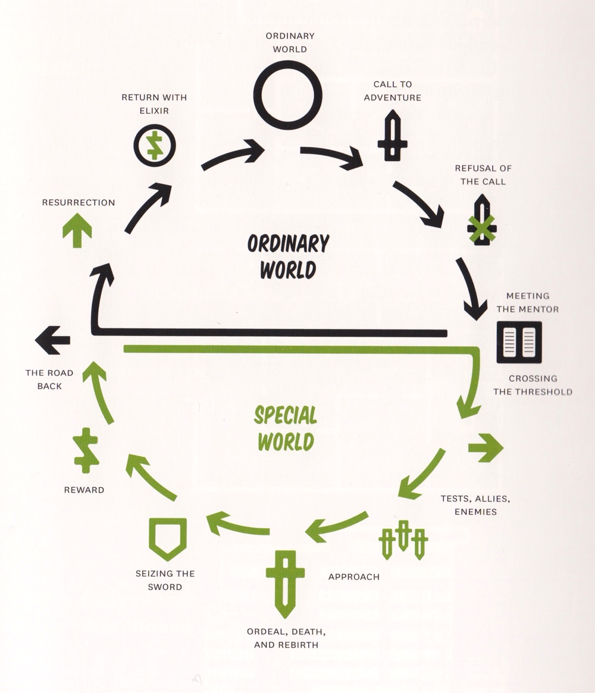

# Descriptif

Important: l'axe est: comment raconter en images, mais pas dans le domaine "fiction". Lier au projet "vidéo institutionnelle", créer transversalité avec cours Communication-Marketing.

Cours de 3 périodes.

Orientation de ce cours:

- Spot publicitaire
- Raconter une histoire
- Narration (en particulier pour les médias numériques, web, médias sociaux)
- Storyboard
- Comment découper
- Comment structurer

Ce cours peut être en lien avec le cours AP "Projet vidéo".

## Matières

### AV 8 - réalisation (analyse, découpage, storyboard)

- Analyse filmique et sémiotique, scène, séquence et plan
- Choisir un angle de réalisation et transcrire un texte en image, avec différentes valeurs de plans
- Découpage technique
- Établir un story-board

### AV 21 - écriture 2

- Construire une expérience narrative pour un site web.
- Construire une histoire audiovisuelle.
- Ecrire une voix off pour une vidéo promotionnelle.

## Exercices type

- Etablir le storytelling pour une campagne de type Kickstarter.
- Narration pour une story instagram visant un effet viral (guerilla marketing).

## 📚 Références

- Ellen Lupton (2017), _Design is storytelling_, Cooper-Hewitt Museum. En bibliothèque Eracom-EPSIC (765 LUP). [Lien Teams](https://teams.microsoft.com/_#/school/files/G%C3%A9n%C3%A9ral?threadId=19%3A8a4ddd0bea3d4db4ae387c20afb9eef3%40thread.tacv2&ctx=channel&context=Design%2520is%2520Storytelling%2520(Lupton%25202017)&rootfolder=%252Fsites%252Fmsteams_58e45f%252FDocuments%2520partages%252FGeneral%252FBiblioth%25C3%25A8que%2520p%25C3%25A9dagogique%252FDesign%2520is%2520Storytelling%2520(Lupton%25202017)).
- Guillaume Lamarre (2018), _L'art du storytelling_, Pyramyd.