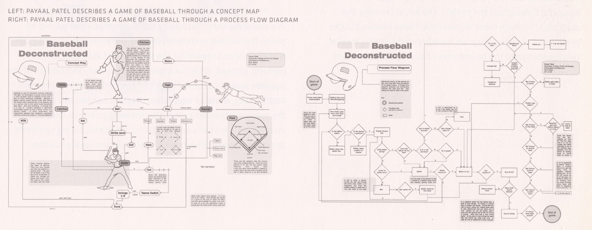

## Descriptif

Ce cours vise à donner aux élèves les outils pour mener leur processus de recherche, dans la phase initiale d'un projet. Il leur apprendra à:

- Analyser un mandat
- Etablir le contexte du client
- Utiliser des techniques d'interview et autres méthodes de recherche
- Démarrer un projet (phase de préparation, recherche exploratoire)

Ce premier cours est général et ne se focalise pas sur le design numérique. Il peut s'appliquer à tout type de projet de design.

Ces compétences seront utiles aux élèves dans tous leurs projets école, ainsi que dans le travail de validation CFC (TPI).

## Structure du cours

Ce cours est à concevoir comme une introduction présentant différentes méthodes. L'approfondissement devra avoir lieu dans les autres cours où ces méthodes de recherche seront appliquées (voir ci-dessous).

Le plan de formation définit la structure suivante:

- **Mener des recherches ciblées** en fonction du projet, avec les moyens et les méthodes appropriés. 10 périodes.
- Analyser et évaluer les résultats de recherche. 5 périodes.
- Définir les paramètres pour la suite du travail. Établir un concept de communication spécifique au projet. 5 périodes.
- Expliquer la documentation d’apprentissage. 5 périodes

### Les méthodes essentielles

- **Interview**: préparation de questionnaire, gestion de l'interview, traitement des résultats.
- **Recherche en bibliothèque**: identifier des ouvrages pertinents pour un sujet. Utiliser Renouvaud, effectuer une commande d'ouvrage. Une séance pourra se dérouler à la bibliothèque Eracom-Epsic.
- **Visualisation graphique**: carte conceptuelle, et autres types de schémas.
- **Prise de notes**: utiliser un carnet de bord, pratiquer la prise de notes (p.ex. avec la méthode Cornell).
- **Dossier de recherche**: produire un dossier qui fait la synthèse des données récoltées.

### Exemples d'exercices

- Lire un mandat et définir des axes de recherche pertinents. Il peut s'agir p.ex. d'un ancien mandat TPI, venant d'un autre cours, etc.
- Préparer **une visite d'exposition** ou une promenade urbaine autour d'une thématique. Produire un dossier de visite (pouvant être utilisé par d'autres classes).
- Recherche **iconographique**: utiliser des banques d'images pour sélectionner des visuels sur une thématique. Identifier la source d'une image.
- Créer des **questionnaires** et effectuer des **interviews**. Exemples de sujets: les habitudes alimentaires, l'utilisation des médias. Interviewer d'autres élèves dans l'école. Ou: les métiers du numérique, interviewer des professonnel·le·s.
- Vérifier la fiabilité de différentes sources. Sur une liste d'informations fournie, identifier les *hoaxes* et *fake news*.
- Ecrire ou compléter un article Wikipédia. Comprendre le fonctionnement et les problématiques de cette ressource.
- Pour une thématique donnée (p.ex. nutrition, santé, environnement) effectuer une recherche à la **bibliothèque EPSIC-ERACOM**. Produire une **bibliographie** et un support visuel pour une thématique donnée.
- Visionner une conférence TED Talk et exercer la prise de notes (cf. [design briefs](https://designbriefs.ch/sketchnote-a-ted-talk/)). Appliquer une méthode de prise de notes (p.ex. méthode Cornell).
- Créer une **carte conceptuelle** (concept model) sur un sujet du quotidien des élèves. P.ex. [le fonctionnement d'un sport](../fichiers/baseball-concept-map.jpg); l'utilisation de la cafétéria de l'école; le processus d'admission de l'Eracom; l'action d'effectuer des achats dans un supermarché; l'utilisation des transports en commun; une série télévisée.
- Effectuer une recherche compétitive.
- Tenir un "blog de recherche" sur une thématique continue pendant le semestre.

### Documentation d'apprentissage

Les apprentis sont tenus de mettre en place leur **documentation d'apprentissage** (compétence 3.7.3 du plan de formation). Ce cours devra consacrer quelques périodes à la mise en place de cette documentation (elle peut constituer l'une des évaluations notées). Les élèves doivent développer leur méthode pour collecter les traces des différents cours. Eléments principaux:

- Un carnet de notes qui accompagne en permanence l'élève.
- Un ou plusieurs outil(s) numérique(s) pour conserver et classer les données importantes (Notion, Bear, Google Keep, Apple Notes...)

Les élèves doivent décider de la structure, de l'organisation, de la forme matérielle (classeur, carnet) et numérique (application cloud) que prend cette documentation. Ils doivent pouvoir expliquer la structure, le sens et l’utilité de cette documentation d’apprentissage. Utilisent-ils des catégories? Des *tags*?

## Relation avec les autres cours

Ce cours donne aux élèves des outils de recherche qu'ils appliqueront régulièrement dans les autres cours:

- Dans les cours AP (Application), les élèves travaillent sur des mandats, notamment dans les cours "[Projet création graphique](../objectifs-ap/creation-graphique.html)", [Projet photo](../objectifs-ap/photo.html), "[Projet design d'interface](../objectifs-ap/design-interface.html)". Ces cours donneront l'occasion d'exercer et de systématiser les méthodes de recherche.
- Le cours **[Techniques créatives 1 - Création et visualisation d'idées](../objectifs-ep/techniques-creatives.html)** (au semestre 2) permet de développer la visualisation d’idées, les moodboards, le mindmapping.
- Le cours "**[Communication marketing 1 - Création de concept](../objectifs-ep/communication-marketing-1.html)**" (au semestre 3) permet d'intégrer ces méthodes dans la phase de préparation d'un projet.
- **[Recherche UX](../objectifs-ep/recherche-ux.html)**: ce deuxième cours dédié à la phase de recherche (au semestre 3) donnera plus de place à l'analyse des données récoltées (comment faire des choix pour la suite du travail). Ce cours se focalise sur la recherche dans le cadre d'un projet numérique (site web, application), et développe la conception de *personas* et les tests utilisateur.

## Ce qui *ne fait pas* partie de ce cours

- ❌ Pas de recherche *créative*
- ❌ Pas de *brainstorming*
- ❌ Pas d'approfondissement des *personas* et techniques UX

## 📚 Références

- Jon Kolko, [Contextual research syllabus](https://www.howiteachdesign.com/02_1_foundational_skills_research.php) - un syllabus complet autour de la recherche en design, mis en place au Austin Center for Design.
- Dan Brown, _Communicating Design_, New Riders, 2011. *Disponible en bibliothèque Eracom-EPISC (004.03.03 BRO)*. [Lien Teams](https://teams.microsoft.com/_#/school/files/G%C3%A9n%C3%A9ral?threadId=19%3A8a4ddd0bea3d4db4ae387c20afb9eef3%40thread.tacv2&ctx=channel&context=Communicating%2520Design%2520(Brown%25202011)&rootfolder=%252Fsites%252Fmsteams_58e45f%252FDocuments%2520partages%252FGeneral%252FBiblioth%25C3%25A8que%2520p%25C3%25A9dagogique%252FCommunicating%2520Design%2520(Brown%25202011)).
- Erika Hall, _La phase de recherche en web design_. Traduit par Charles Robert. Paris: Eyrolles, 2015. *Disponible en bibliothèque Eracom-EPISC*
- Gavin Ambrose, Neil Leonard, _[Recherche créative](https://pyramyd-editions.com/products/recherche-creative)_. Pyramid. "La recherche primaire, la recherche secondaire, la recherche tertiaire, les contextes sociaux et artistiques, le public cible, le brief, les sources, les études de marché, les enquêtes de terrain, les résultats de recherche, l'analyse, la synthèse, les tests, la présentation de la recherche..."
- Russel Bestley, Ian Noble, _Recherche visuelle: Méthodologies de recherche en graphisme_. Pyramid, 2012.
- Laurel, Brenda; Lunenfeld, Peter (2003). _Design Research: Methods and Perspectives_. MIT Press.
- Chipchase, Jan (2017), _[The Field Study Handbook](https://studiodradiodurans.com/products/the-field-study-handbook-field-edition)_
