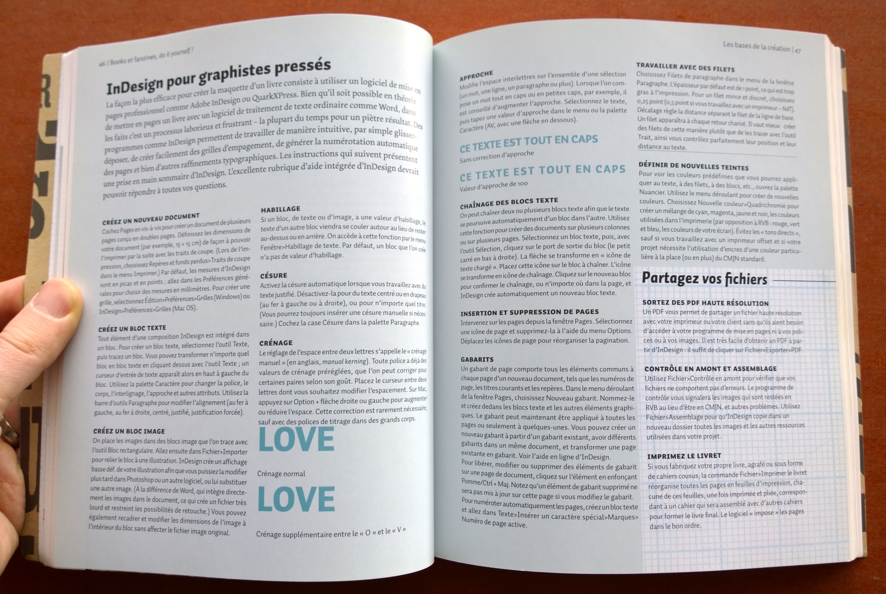

## Typographie et InDesign

Ce cours a pour objectif de fournir aux élèves des notions de base en typographie. Il s'agit d’établir les bases d’une sensibilité globale à l’agencement des lettres sur tous les supports imprimés et digitaux, autant dans un contexte de publication, d’affiche, de signalétique que de navigation web. 

Les élèves apprendront:

- à identifier, sélectionner et utiliser des caractères typographiques.
- à créer une composition visuelle selon les règles typographiques (hiérarchisation de l’information, de contraste de formes et d’impact graphique).
- à utiliser les logiciels de mise en page (avant tout le logiciel standard dans ce domaine: Adobe InDesign).

Ce cours comporte la formation de base sur le logiciel **InDesign**, avec pour objectif la conception de supports tels que flyers, affiches, brochures.

## Objectifs évaluateurs selon plan de formation:

Selon le [plan de formation](https://github.com/eracom/documents-formation-imd), les apprentis IMD:

- expliquent les bases et les règles typographiques et les utilisent correctement.
- développent et établissent leurs travaux créatifs avec des outils et des logiciels.
- vérifient leurs travaux en ce qui concerne la lisibilité, le caractère, l’expression et l’effet.
- hiérarchisent et structurent des textes et les concrétisent en fonction du destinataire.
- décrivent l’histoire de l’écriture partant de ses origines jusqu’au présent.
- nomment les exigences par rapport à l’écriture pour les systèmes de communication numériques.
- décrivent les formats de fonte numériques les plus importants et leur possibilités d’utilisation.
- expliquent les bases de la création de caractères.
- utilisent la typographie/l’écriture comme instrument de navigation.
- apprécient les caractères à l’aide de la terminologie spécialisée et les attribuent à un système de classification.

## Exemples de travaux

Voici des travaux-types pouvant être assignés dans le cadre de ce cours.

### 1. Connaissance de la typographie:

- Effectuer des recherches autour de la typographie.
- Pour une fonte donnée: décrire son histoire, montrer des travaux visuels emblématiques, créer une composition.
- Effectuer un test écrit sur la connaissance des termes de la typographie, des fontes les plus utilisées, de la classification.
- Corriger les erreurs typographiques dans un document (p.ex. un site web).

### 2. Composition typographique: flyer, affiche.

- Créer une affiche pour un événement, avec une hiérarchie typographique (p.ex. festival de film, musique, sport...).

### 3. Composer une brochure: un dossier d'information sur une thématique, une plaquette présentant un produit...

- Cela devra préparer les élèves à produire des _dossiers de présentation_ dans les autres cours (p.ex. dossier de recherche pour un projet). Ce savoir-faire leur sera utile en fin de formation, pour le dossier faisant partie du TPI.
- En fonction du temps disponible, il sera approprié de leur fournir le contenu image et texte, pour qu'ils se focalisent sur la mise en page.

## Ressources à utiliser

Ce cours peut faire usage des ressources suivantes:

- La **bibliothèque Eracom** (située au rez de l'EPSIC) comporte une section très riche sur la typographie. Il faut que les élèves prennent connaissance de cette ressource et l'utilisent pour ce cours. Quelques séances de travail pourront prendre lieu à la bibliothèque.
- Les fontes de la typothèque Eracom. Une librarie de fontes est disponible pour les élèves Eracom à des fins éducatives. Les élèves devront installer ces fontes dans le cadre de ce cours.
- Ce cours peut intégrer l'unité "Typographie" (Unit 4) du [AIGA Graphic Design curriculum](https://www.aiga.org/resources/academic-design-education/graphic-design-curriculum).
- Le livre "[Typo et design pour écran](https://eduvaud-my.sharepoint.com/:f:/g/personal/pr51kln_eduvaud_ch/EhT1xgj2P7dNtIH64Lp_d2oB2aSeZAU6t4GgBKOTFTsruQ?e=yFNyRi)" (Ellen Lupton, 2015, Pyramyd), surtout les deux premiers chapitres (_les polices de caractères sur écran, le texte sur écran_).

### Livres recommandés

- _Typo et design pour écran_, Ellen Lupton, Pyramyd, 2015 (traduction de: _Type on Screen_, 2014).
- "[InDesign pour graphistes pressés](../fichiers/InDesign-DIY-300dpi.jpg)", dans: _Books et fanzines, do it yourself!_, Ellen Lupton, Eyrolles, 2009. **En bibliothèque Eracom-EPSIC (655.26 BOO)**.
- _Graphic Design: The New Basics_, Ellen Lupton, Princeton Architectural Press, 2015. **En bibliothèque Eracom-EPSIC (765 LUP)**.
- _Sales caractères - Petite histoire de la typographie_, Simon Garfield, 2012. (en bibliothèque Eracom-Epsic)
- _Design for Hackers_, David Kadavy
- [Les références typographie](https://cours-web.ch/typographie/references.html) de cours-web.ch

L'essentiel d'InDesign, tiré du livre _Books et fanzines, do it yourself!_, Ellen Lupton, Eyrolles
